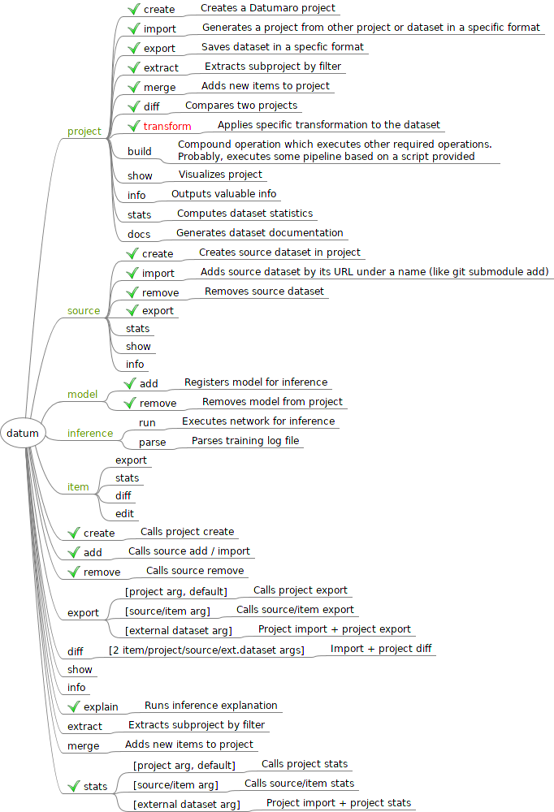

# Datumaro

<!--lint disable list-item-indent-->

## Table of contents

- [Concept](#concept)
- [Design](#design)
- [RC 1 vision](#rc-1-vision)

## Concept

Datumaro is:
- a tool to build composite datasets and iterate over them
- a tool to create and maintain datasets
  - Version control of annotations and images
  - Publication (with removal of sensitive information)
  - Editing
  - Joining and splitting
  - Exporting, format changing
  - Image preprocessing
- a dataset storage
- a tool to debug datasets
  - A network can be used to generate
    informative data subsets (e.g. with false-positives)
    to be analyzed further

### Requirements

- User interfaces
  - a library
  - a console tool with visualization means
- Targets: single datasets, composite datasets, single images / videos
- Built-in support for well-known annotation formats and datasets:
    CVAT, COCO, PASCAL VOC, Cityscapes, ImageNet
- Extensibility with user-provided components
- Lightweightness - it should be easy to start working with Datumaro
  - Minimal dependency on environment and configuration
  - It should be easier to use Datumaro than writing own code
    for computation of statistics or dataset manipulations

### Functionality and ideas

- Blur sensitive areas on dataset images
- Dataset annotation filters, relabelling etc.
- Dataset augmentation
- Calculation of statistics:
  - Mean & std, custom stats
- "Edit" command to modify annotations
- Versioning (for images, annotations, subsets, sources etc., comparison)
- Documentation generation
- Provision of iterators for user code
- Dataset building (export in a specific format, indexation, statistics, documentation)
- Dataset exporting to other formats
- Dataset debugging (run inference, generate dataset slices, compute statistics)
- "Explainable AI" - highlight network attention areas ([paper](https://arxiv.org/abs/1901.04592))
  - Black-box approach
    - Classification, Detection, Segmentation, Captioning
    - White-box approach

### Research topics

- exploration of network prediction uncertainty (aka Bayessian approach)
  Use case: explanation of network "quality", "stability", "certainty"
- adversarial attacks on networks
- dataset minification / reduction
  Use case: removal of redundant information to reach the same network quality with lesser training time
- dataset expansion and filtration of additions
  Use case: add only important data
- guidance for key frame selection for tracking ([paper](https://arxiv.org/abs/1903.11779))
  Use case: more effective annotation, better predictions

## Design

### Command-line

Use Docker as an example. Basically, the interface is partitioned
on contexts and shortcuts. Contexts are semantically grouped commands,
related to a single topic or target. Shortcuts are handy shorter
alternatives for the most used commands and also special commands,
which are hard to be put into specific context.



- [FreeMind tool link](http://freemind.sourceforge.net/wiki/index.php/Main_Page)

### High-level architecture

- Using MVVM UI pattern


### Datumaro project and environment structure

<!--lint disable fenced-code-flag-->
```
├── [datumaro module]
└── [project folder]
    ├── .datumaro/
    │   ├── config.yml
    │   ├── .git/
    │   ├── importers/
    │   │   ├── custom_format_importer1.py
    │   │   └── ...
    │   ├── statistics/
    │   │   ├── custom_statistic1.py
    │   │   └── ...
    │   ├── visualizers/
    │   │   ├── custom_visualizer1.py
    │   │   └── ...
    │   └── extractors/
    │       ├── custom_extractor1.py
    │       └── ...
    └── sources/
        ├── source1
        └── ...
```
<!--lint enable fenced-code-flag-->

## RC 1 vision

In the first version Datumaro should be a project manager for CVAT.
It should only consume data from CVAT. The collected dataset
can be downloaded by user to be operated on with Datumaro CLI.

<!--lint disable fenced-code-flag-->
```
        User
          |
          v
 +------------------+
 |       CVAT       |
 +--------v---------+       +------------------+       +--------------+
 | Datumaro module  | ----> | Datumaro project | <---> | Datumaro CLI | <--- User
 +------------------+       +------------------+       +--------------+
```
<!--lint enable fenced-code-flag-->

### Interfaces

- [x] Python API for user code
  - [ ] Installation as a package
- [x] A command-line tool for dataset manipulations

### Features

- Dataset format support (reading, exporting)
  - [x] Own format
  - [x] COCO
  - [x] PASCAL VOC
  - [ ] Cityscapes
  - [ ] ImageNet
  - [ ] CVAT

- Dataset visualization (`show`)
  - [ ] Ability to visualize a dataset
    - [ ] with TensorBoard

- Calculation of statistics for datasets
  - [ ] Pixel mean, std
  - [ ] Object counts (detection scenario)
  - [ ] Image-Class distribution (classification scenario)
  - [ ] Pixel-Class distribution (segmentation scenario)
  - [ ] Image clusters
  - [ ] Custom statistics

- Dataset building
  - [x] Composite dataset building
  - [ ] Annotation remapping
  - [ ] Subset splitting
  - [x] Dataset filtering (`extract`)
  - [x] Dataset merging (`merge`)
  - [ ] Dataset item editing (`edit`)

- Dataset comparison (`diff`)
  - [x] Annotation-annotation comparison
  - [x] Annotation-inference comparison
  - [ ] Annotation quality estimation (for CVAT)
    - Provide a simple method to check
      annotation quality with a model and generate summary

- Dataset and model debugging
  - [x] Inference explanation (`explain`)
  - [x] Black-box approach ([RISE paper](https://arxiv.org/abs/1806.07421))
  - [x] Ability to run a model on a dataset and read the results

- CVAT-integration features
  - [x] Task export
    - [x] Datumaro project export
    - [x] Dataset export
    - [ ] Original raw data (images, a video file) can be downloaded (exported)
      together with annotations or just have links
      on CVAT server (in the future support S3, etc)
      - [x] Be able to use local files instead of remote links
        - [ ] Specify cache directory
  - [x] Use case "annotate for model training"
    - create a task
    - annotate
    - export the task
    - convert to a training format
    - train a DL model
  - [ ] Use case "annotate and estimate quality"
    - create a task
    - annotate
    - estimate quality of annotations

### Optional features

- Dataset publishing
  - [ ] Versioning (for annotations, subsets, sources, etc.)
  - [ ] Blur sensitive areas on images
  - [ ] Tracking of legal information
  - [ ] Documentation generation

- Dataset building
  - [ ] Dataset minification / Extraction of the most representative subset
    - Use case: generate low-precision calibration dataset

- Dataset and model debugging
  - [ ] Training visualization
  - [ ] Inference explanation (`explain`)
    - [ ] White-box approach

### Properties

- Lightweightness
- Modularity
- Extensibility
